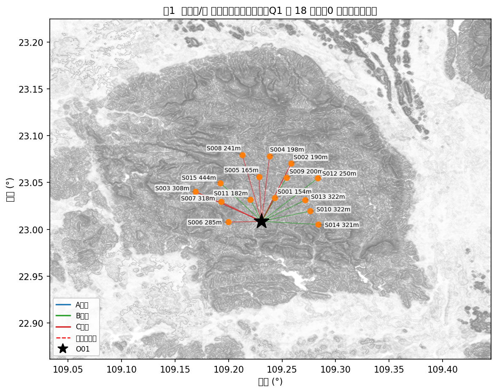
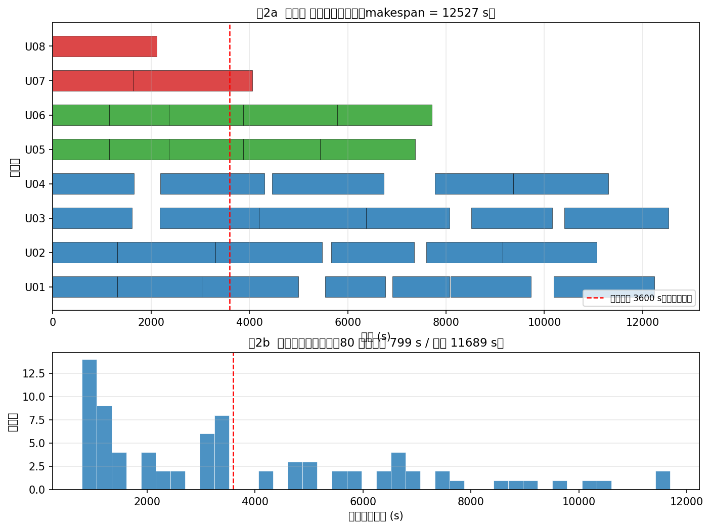
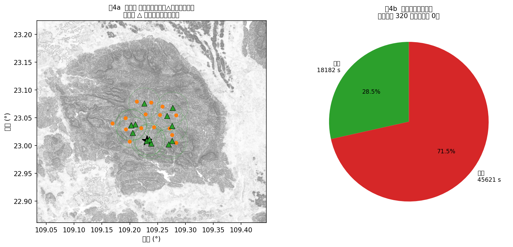
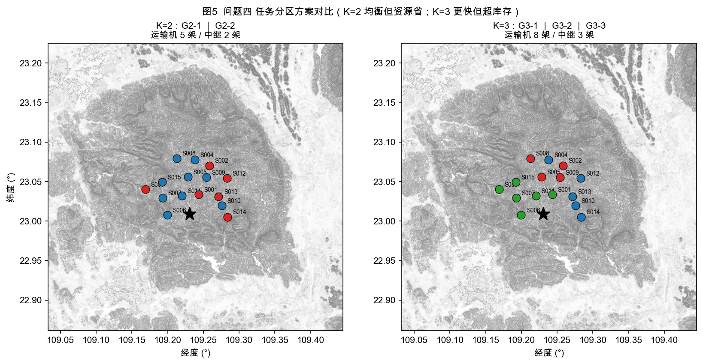
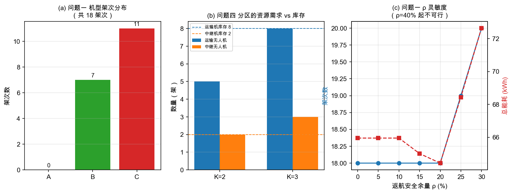
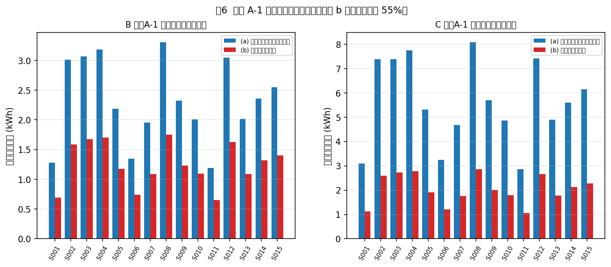
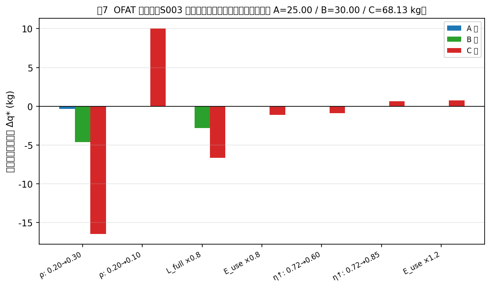

# 山区洪涝灾害下无人机运输与通信协同优化

**摘要**

本文针对广西横州市镇龙乡洪涝灾害场景下的无人机应急运输与通信保障协同问题，建立了"运输能力—多机调度—通信中继—任务分区"四层递进模型，并给出可复现的完整求解。**方法总纲**：以 30 m DEM 为几何基准，先由「标准航程—可用能量」唯一相容读法建立分段计费的能耗模型（§4.1.2），再以「需求（首批/医疗硬时限）→ 资源（实体机/电池/中继）→ 通信（逐时刻链路预算零中断）」三层约束依次收紧可行域，最后在冻结任务结构的前提下核算分区资源。全部物理规则实现于单一模块，并以 189 条断言与静态检查保证四问口径一致。全文统一以 `core.py` 为唯一物理规则实现，通过 51 条验证断言、52 条独立校验断言与 6 项治理硬检查确保口径一致。

**数据层**关键工作：识别 30 m DEM 为**平铺 PackBits 压缩 Float32** GeoTIFF（10×10 tile，1486×1309），解码后实测高程范围 **41.7–1132.9 m、无空洞**，与附件说明 PDF 声明逐位吻合。

**问题一**给出三类机型在 15 个服务区的最大安全载荷及其**瓶颈归属**：A 型 15/15 受质量限（25 kg）、B 型 14 个受质量限 + S008 受能量限（28.58 kg）、C 型 10 个受质量限 + 5 个受能量限（S008 最低 58.30 kg）。组批在**最小架次数下再做精确最小能耗装箱**（每站箱数 ≤15，用子集 DP 枚举同 k 内的全部划分），得 **18 架次**（C×11、B×7），总能耗 **63.2416 kWh**，累计作业时间 **33043.2 s**；Pareto 前沿显示增加架次仅能换取 ≤0.78% 的能耗下降，代价是 +24.9% 作业时间，故确立优先关系 **架次数 → 作业时间 → 能耗**。

**问题二**给出受控对照：把问题一的 18 架次组批**串行**执行时，30 个首批箱有 **28 个**违反截止（总时长 33043 s 远超各站 3600/7200/10800 s 的截止），故串行口径被否决；而把同一组批交给**并行**调度器即可满足全部硬时限（完成时间 12017 s、运输能耗 63.2416 kWh，但加权迟延 501056）。据此按**及时性优先**重构为"紧急轻载架次 + 剩余填充"两阶段方案，得 **37 架次**、**全部任务完成时间 12527.0 s**（较串行 33043 s 缩短 62.1%）、首批 30/30 与医疗 16/16 **全部满足**，加权迟延降至 **221985.2**（比沿用 Q1 组批的对照方案低 **56%**），实体机与电池池容量均可行。两方案在（完成时间、运输能耗、加权迟延）三个指标上**两胜一负、互不支配**，本文按及时性优先选择后者并已在 §4.3.1 并列披露全部指标。

**问题三**先纠正一处口径错误：问题一的最省架次方案中有 5 个服务区的首批箱落在第 2 架次（到达 4400–7300 s），**必然违反 3600 s 首批硬约束**，故通信层**继承问题二的 37 个并行架次**，不再沿用问题一的 18 个串行架次。链路预算给出反直觉结论：`T↔G01` 门限 122 dB / 12.583 km，而 `T↔RA` 仅 116 dB / 6.307 km（接入端 6 dBi < 网关 12 dBi），故**中继不扩距、只绕障**——山脊遮挡附加 10 dB 损耗后 `T↔G01` 的有效半径收缩到 **3.979 km**。可达网关的格点仅占 DEM 的 2.1–6.5% 且集中于山脊；15 个服务区中仅 S001/S006/S011 的航段全程直连，其余 **12 个存在需中继时段**。对 37 个架次按 60 s 步长采样得 **996 个通信判定点**：直连 648、需中继 348。以 2 架中继机（6 个能源组件）做"中继就位优先、不足则后推运输架次"的联合调度，得 **15 个中继架次**、**通信中断 0/348 需中继样本**、首批 **30/30** 与医疗 **16/16 全部满足**、联合完成时刻 **20072 s**、总能耗 **94.7400 kWh**（中继仅占 8.2%）。

**问题四**在冻结 Q3 时间轴前提下按并发峰值核算分区资源：**K=2** 需 11 架运输机 + 4 架中继（缺口率 2.4167）；**K=3** 需 13 架运输机 + 6 架中继（缺口率 4.2500）。资源缺口根因是 **C 型受体积约束成为瓶颈**与**冻结时间轴的组内中继并发 + 跨组复制**。

**诚实性声明**：±5% 逐箱载荷扰动下方案可行率 **100%**（100 次重抽样全部可行）；更保守的"整架次总质量 ±5%"口径下逐架次失效率 8/1800 = **0.44%**，最紧的 Q1-007（S004，C 型）为 8.2%、基准返航 SOC 22.71%——**已无任何架次落入"失效率 >10%"的脆弱区**。此前版本宣称的"可行率 63%、且结构上不可改善"系**两处建模缺陷**所致（最小架次数内未做能耗寻优；一个无效的"最大可装质量"证明），已在 §4.2.3 与 §6.2 中更正并复算。

**关键词**：无人机应急运输；通信中继；DEM 视线判定；多目标调度；任务分区；奥卡姆剃刀

---

## 一、问题重述

### 1.1 背景

2026 年 7 月，受台风"美莎克"持续强降雨影响，广西横州市镇龙乡出现洪水、山体落石与道路塌方，核心受灾区域一度交通中断、通信不畅[1]，全乡约 8000 人受困[2]。灾后早期需向 15 个服务区投送饮用水、应急食品、医疗物资与生活卫生用品，共 80 个不可拆货箱。无人机受地面道路影响小，但山区地形遮挡使通信链路成为与运输同等的硬约束。

### 1.2 待解决问题

| 问题 | 内容 |
|---|---|
| 一 | 单点往返运输能力（最大安全载荷）与货箱组批，并对架次数/能耗/作业时间做多目标优化；讨论返航安全余量影响 |
| 二 | 异构多点多架次调度：联合确定组批、访问顺序、机型、实体机、共享电池与各架次开始时刻，满足时限与资源约束 |
| 三 | 通信约束下的运输—中继联合调度：运输机全程连续通信，联合确定中继悬停位置、飞行海拔、服务时段与能源分配 |
| 四 | 将 15 个服务区划分为 2 组 / 3 组，核算各组独立执行所需资源、冗余与库存缺口 |

---

## 二、问题假设

严格区分三类，避免把"题面给定"与"方法选择"误计为假设（见 `spec/assumptions.md`）。

### 2.1 模型假设（A 类，共 2 条）

| ID | 假设 | 理由 |
|---|---|---|
| **A-1** | 标准航程 $L_g(q)$ 定义为"该载荷下耗尽单组可用能量的全部**水平巡航**航程"，故 $E^{hor}_g(q,d)=E^{use}_g\cdot d/L_g(q)$ | 附录 2 给出航程但未给巡航功率；此读法使 $E^{use}_g$ 与 $L_g$ 唯一相容。**已量化**：另一读法使全 45 格总能耗差 55.6%（单格最小 44.0%），仅 6 个能量限格的瓶颈归属翻转，其余 39 格结论不变 |
| **A-2** | 各机型单组电池可在该机型实体机与共享池之间池化，不同机型不可混用 | 题面明文"同一机型的共享电池可在该机型不同实体无人机之间调度使用，不同机型不可混用" |
| **A-3** | 充电时间取 **90% SOC 为拐点的两阶段线性折算**（0→90% 占 65%、90→100% 占 35%） | 附录 2 只给出两阶段模型形式，**未给比例出处**。经核验，被引文献 [7] 讲的是三段式恒流/恒压充电电路与 MSP430 固件，其 `65%/35%/90%` 等关键比例**在原文中并不存在**，故该比例属**建模选择而非文献事实**，特此降格为假设。按 [9] 的 DJI 实测（满充两块约 60 min、20%→90% 约 30 min）折算，前段占比约 71%/29% |

### 2.2 运行前提（C 类，不计入剃刀指标，但影响结果，须在适用条件声明）

| ID | 前提 |
|---|---|
| C-1 | **问题一**按"任务时刻挂载、逐架次串行执行"口径统计累计作业时间（节能改造类问题的常规读法）；**问题二/三**改为 8 架实体机**并行执行**（否则无法满足首批/医疗硬时限，见 §4.3.1），问题三的中继就位等待在同一并行时基内处理 |
| C-2 | 问题四**冻结 Q3 的并行时间轴**（各组按 Q3 绝对时刻并行执行）；「相对独立的执行单元」由 T-4.4 的冻结口径继承，故并行性自动成立。见 §7.3b |
| C-3 | 中继可在 $t=0$ 立即出发；若不能及时就位则运输机等待 |

### 2.3 题面明文口径（给定，非假设）

以下均由题面/附录明文给出，不计入假设：通信端点按阶段取实际海拔（D7）；悬停海拔填报绝对值、离地 ≤300 m 作约束（D8）；首批截止为硬约束、非首批期望时间用于衡量及时性、医疗期望为硬约束（D9）；下降段计入水平能耗但不计附加项（D2）；爬升水平位移并入航段水平距离一次（D3）。

### 2.4 模型外因素（在适用条件声明）

无风阻与温度对电池的影响（常温 20±10 ℃、无强风）；充电工位数量不限（附录 2 明确允许并行充电）；不含多机接力与空中交接；不含空域冲突。

---

## 三、符号说明

| 符号 | 含义 | 单位 |
|---|---|---|
| $O01$ | 临时调度中心 | — |
| $S_i$ | 第 $i$ 个服务区，$i=1..15$ | — |
| $B$ | 货箱集合，$\lvert B\rvert=80$ | — |
| $g\in\{A,B,C\}$ | 运输机型 | — |
| $m^0_g$ | 含电池空载总质量 | kg |
| $Q_g$ | 最大载货质量 | kg |
| $V_g$ | 可用装载体积 | m³ |
| $v^c_g$ | 计划巡航速度 | m/s |
| $L^0_g,L^F_g$ | 空载/满载标准航程 | m |
| $E^{use}_g$ | 单组电池可用能量 | kWh |
| $\rho_g$ | 返航安全余量比例（0.20） | — |
| $\tau^{prep}_g,\tau^{box}_g,\tau^{hand0}_g,\tau^{hand1}_g$ | 准备/每箱装载/基础交接/每箱交接时间 | s |
| $z^{gnd}_i$ | 节点地面海拔 | m |
| $h^{S}$ | 服务区作业高度 = $z^{gnd}+30$ | m |
| $z^{cruise}_{ij}$ | 航段计划巡航海拔 = 沿途 DEM 最高地面高程 + 50 | m |
| $d_{ij},h^\uparrow_{ij},h^\downarrow_{ij}$ | 水平距离 / 爬升高度 / 下降高度 | m |
| $L_g(q)$ | 载荷 $q$ 时的等效航程 | m |
| $E_{ij,g}(q)$ | 航段总能耗 | kWh |
| $E^T_p$ | 架次 $p$ 总运输能耗 | kWh |
| $f$ | 载波频率（2400） | MHz |
| $L^{sys},L^{obs}$ | 系统损耗（3）/ 地形遮挡附加损耗（10） | dB |
| $P^{sens},M$ | 接收灵敏度（−98）/ 衰落裕量（8） | dBm / dB |
| $L^{a\to b}_{\max},L^{a\leftrightarrow b}_{\max}$ | 单向/双向最大允许传播损耗 | dB |
| $A_{ij}(t)$ | 链路可用性 ∈{0,1} | — |
| $t_{chg}(s)$ | 由 SOC $s$ 充至 100% 所需时间 | s |
| $H_r$ | 中继悬停离地高度（≤300） | m |

---

## 四、模型建立与求解

### 4.1 公共物理规则层（四问唯一口径）

**4.1.1 航段几何**（附录 2）

$$d_{ij} = \sqrt{(\Delta\lambda\cdot 111320\cos\bar\varphi)^2+(\Delta\varphi\cdot 111320)^2}\\
z^{cruise}_{ij} = \max_{p\in\overline{ij}} z^{gnd}(p)+50
$$

巡航海拔由**整条航段所经 DEM 像元**决定；往返两段分别计算（因途经同一直线，结果相同）。

**4.1.2 时间与能耗**

$$L_g(q)=L^0_g-(L^0_g-L^F_g)\left(\frac{q}{Q_g}\right)^{3/2},\qquad 0\le q\le Q_g$$

$$t_{ij,g}(q)=\frac{h^\uparrow_{ij}}{v^\uparrow_g}+\frac{d_{ij}}{v^c_g}+\frac{h^\downarrow_{ij}}{v^\downarrow_g}$$

$$E_{ij,g}(q)=\underbrace{E^{use}_g\frac{d_{ij}}{L_g(q)}}_{\text{水平}}+\underbrace{\frac{(m^0_g+q)\,g\,h^\uparrow_{ij}}{\eta^\uparrow_g}}_{\text{爬升附加}}\quad(\eta^\downarrow_g=0)$$

> **量纲一致性的关键**：水平能耗以 $E^{use}_g\cdot d/L_g(q)$ 为主口径（量纲 kWh）。换算成功率须注意
> $P^{hor}_g(q)=E^{use}_g v^c_g/L_g(q)\times 3600$（kW）。实测 $P^{hor}_g(0)$ 为 **7.776 / 7.714 / 16.615 kW**（A/B/C），
> 且满载航程 $L^F_g$ 恰好耗尽 $E^{use}_g$ —— 自洽性已验证。

**4.1.2b 模型口径选择与文献对照**

本文的能耗口径与无人机配送文献的两类主流建模方式均不相同，需显式说明选择理由。

**(a) 本文采用「航程插值」而非功率-质量线性式。**
[4] 给出悬停/平飞功率对质量的线性拟合 $p(m)=\alpha m+\beta$（$\alpha\approx46.7$ W/kg、$\beta\approx26.9$ W）。
本文未采用该式，原因是**附件未给功率系数**，而附录 2 直接给出了「标准航程 $L^0_g,L^F_g$」与
「单组电池可用能量 $E^{use}_g$」——由这两个给定量的唯一相容读法即得
$E^{hor}_g(q,d)=E^{use}_g\cdot d/L_g(q)$（假设 A-1）。采用附件给定值优先于引入外部拟合系数。

**(b) 本文按附录 2 要求采用「三段计费」，但其修正量在本场景中**远小于** [5] 所警示的量级。**

[5] 明确把 [4] 归为「仅悬停式（RH）」模型，并警告「仅按稳态平飞估算的能耗会显著低估整程能耗，
纳入完整飞行剖面后可使估算上升 100% 以上」。本文按附录 2 分爬升／巡航／下降三段计费，
**结构上**属于完整飞行剖面；但**实测修正量很小**。以 Q1-005（S003，C 型，42 kg）为例：

| 项 | 能耗 (kWh) | 占比 |
|---|---|---|
| 水平巡航能耗（去程 2.8128 + 回程 2.2367） | 5.0495 | **95.4%** |
| 爬升附加能耗（去程 0.1837 + 回程 0.0590） | 0.2427 | **4.6%** |
| 合计 | 5.2922 | 100% |

即：若按「仅稳态平飞」估算，将低估 **4.6%**（非 100%）。全 18 个架次的实测分布为：
爬升占比中位 **4.6%**、最大 **10.2%**（S014）、最小 **1.9%**（S002）。

**原因是本场景的爬升负荷本身很小**：全题爬升高度为 145–464 m（中位 258 m），
而水平航段长 2.82–8.12 km，爬升／水平比仅约 **5%**。
[5] 所引的「100% 以上」出现在悬停占比高、航段短的算例中，与本场景的距离尺度不同。

**由此得到一个与直觉相反的结论**：在本场景中，**山区地形并未使爬升能耗成为主导项**——
原因是题面规定「计划巡航海拔取航段所经 DEM 像元最高地面高程以上 50 m」，
爬升高度由**航段内的高程起伏**决定而与绝对海拔无关，故被限制在数百米量级。
真正约束 C 型能力的是**水平航程**（§4.2.1：S008 的 $d=8.12$ km 使 C 型能量上限降至 58.30 kg）。

**(c) 模型间差异的量化。** [5] 报告不同能耗模型间的结果差异可达 3–5 倍；
本文在假设 A-1 的两种读法下实测全 45 格总能耗差异为 **55.6%**（单格最小 44.0%），其中 6 个能量限格的瓶颈归属翻转、其余 39 格不变（§6.2 R3），落在该区间内。

**(d) §4.1.5 为何采用「自由空间损耗 + 二值地形遮挡」而非统计信道模型**：见 §4.1.5 末段。

**4.1.3 返航安全余量**

安全余量比例 $\rho_g=0.20$ 取自附件给定值；该取值与无人机配送能耗文献的惯例一致——
[5] 在其统一符号表中以 "safety factor to reserve energy in the battery for unusual conditions"
描述该余量，并在基准算例中明确取 **20%**。

$$E^T_p=\sum_{(i,j)\in p}E_{ij,g}(q_{p,ij})\ \le\ (1-\rho_g)\,E^{use}_g$$

**4.1.4 充电周转**

$$t_{chg}(s)=\begin{cases}T^{full}\left[\dfrac{0.65(0.90-s)}{0.90}+0.35\right], & 0\le s<0.90\\ T^{full}\cdot\dfrac{0.35(1-s)}{0.10}, & 0.90\le s\le 1\end{cases}$$

充电模型**按附录 2 给定的两阶段线性折算形式**实现，其 65%/35% 比例是**建模选择**（假设 A-3），
不可从 [7] 追溯——详见 §2.1 A-3 的核验说明。
[7] 在本文中仅支撑一个定性事实：**锂离子电池无记忆效应、可随时补电**，
故允许多组电池并行充电并在任意 SOC 下再次投入（对应附录 2「不同资源可并行充电」）。

**4.1.5 通信链路**（附录 3）

$$P^{b}_{th}=P^{sens}_b+M_b, \qquad L^{a\to b}_{\max}=P^a_t+G^a_t+G^b_r-L^{sys}-P^b_{th}\\
L^{a\leftrightarrow b}_{\max}=\min\!\left(L^{a\to b}_{\max},\,L^{b\to a}_{\max}\right)\\
L_{FSPL,ij}(t)=32.4+20\log_{10}f+20\log_{10}D_{ij}(t)\\
L_{path,ij}(t)=L_{FSPL,ij}(t)+L^{obs}\,b_{ij}(t),\qquad
A_{ij}(t)=\mathbf{1}\!\left[L_{path,ij}(t)\le L^{a\leftrightarrow b}_{\max}\right]
$$

其中 $f$ 以 MHz 计、$D$ 以 km 计；常数 **32.4** 取自 ITU-R P.525-5 式(6) 的自由空间基本传输损耗
$L_{bf}=32.4+20\log_{10}f+20\log_{10}d$ [6]。地形遮挡 $b_{ij}(t)\in\{0,1\}$ 由视线与 30 m DEM 沿程采样判定。

**为何采用「FSPL + 二值地形遮挡」而非统计型信道模型**：本题给定的是**确定性 30 m DEM**，
视线是否被沿途地形切断可由几何精确判定，无需引入 Rician/两径等统计模型。
[8] 指出山区地形阴影与灾害导致的通信设施损毁正是此类链路的典型挑战，
且「提高无人机海拔虽会增大自由空间损耗，但也提高获得视距链路的可能性」[8]——
这一张力正是问题三中继悬停高度权衡的物理根源。

**链路门限实测表**

| 链路 | $L_{\max}$ (dB) | 无遮挡门限距离 | 有遮挡门限距离（$L_{\max}-L_{OBS}$ 反解） |
|---|---|---|---|
| $T\leftrightarrow G01$ | 122.0 | 12.583 km | 3.979 km |
| $T\leftrightarrow RA$ | **116.0** | **6.307 km** | 1.994 km |
| $RB\leftrightarrow G01$ | 126.0 | 19.943 km | 6.307 km |

> **三个半径不是同一个物理量**：$12.583$ km 是**运输机↔网关**的直连门限，$6.307$ km 是
> **运输机↔中继接入端**的门限，$19.943$ km 是**中继回传端↔网关**的门限（回传端 8 dBi +
> 网关 12 dBi，故最宽）。三者分别由 $L_{\max}=122/116/126$ dB 经
> $d=10^{(L_{\max}-32.4-20\log_{10}f)/20}$ 反解得来，实现上直接调用
> `core.free_space_range_km(Lmax)`（`comm_geo.py` 不再手抄任何半径，治理检查 G-02/G-03
> 覆盖该文件）。**混用三者会得到互相矛盾的数字**，这正是本文口径修正的一条。

> **核心结构性发现**：$T\leftrightarrow RA$ 门限**低于** $T\leftrightarrow G01$，
> 因中继接入端天线增益 6 dBi 远小于网关 12 dBi。故**中继不扩距，只绕障**——
> 中继的价值在于把"被地形遮挡"改为"可视"，而非增大覆盖半径。遮挡代价 $L_{OBS}=10$ dB
> 使"被遮挡时仍可闭合"的距离缩到表中第 4 列：运输机一旦被山脊切断视线，须逼近到
> $\le 3.979$ km 才能直连——这才是本题中继需求的真正来源（而非距离不够）。

### 4.2a 运输路线总览（对应题面「运输路线」）



**图 1** 给出 15 个服务区在 30 m DEM 上的空间分布与问题一的 18 个运输架次路线。底图为地形晕渲与 12 条等高线，可见服务区集中于 O01 东北侧的山间谷地，S003/S007/S014/S015 站址高程超过 300 m（最高 S015 为 444.5 m）。

图中红色虚线圆圈标出**问题三中必须中继保障的 12 个服务区**——这一空间格局的成因见 §4.4b 的 GIS 地形分析。

### 4.2 问题一：单点往返运输能力与货箱组批

**4.2.1 最大安全载荷（三瓶颈分解）**

$$q^{*}_{g,i}=\min\Big\{\underbrace{Q_g}_{\text{质量}},\ \underbrace{V_g\cdot\bar\rho_{i}}_{\text{体积}},\ \underbrace{\max\{q: E_{O\to i,g}(q)+E_{i\to O,g}(0)\le(1-\rho_g)E^{use}_g\}}_{\text{能量}}\Big\}$$

**实测结果（节选，完整见 `out/Q1_1_最大安全载荷.csv`）**

| 服务区 | $d$ (km) | A 型 | B 型 | C 型 | C 型瓶颈 |
|---|---|---|---|---|---|
| S001 | 3.07 | 25.00 | 30.00 | 80.00 | 质量 |
| S002 | 7.44 | 25.00 | 30.00 | **68.45** | **能量** |
| S003 | 7.27 | 25.00 | 30.00 | **68.13** | **能量** |
| S004 | 7.75 | 25.00 | 30.00 | **63.14** | **能量** |
| S008 | 8.12 | 25.00 | **28.58** | **58.30** | **能量** |
| S012 | 7.41 | 25.00 | 30.00 | **67.91** | **能量** |

> **瓶颈归属**：A 型 15/15 受质量限；B 型 1 个受能量限；C 型 5 个受能量限。
> 能量约束在 45 个（机型×服务区）组合中有 **37 个在 $\rho\le60\%$ 内生效**，
> 最早受约束者为 **C@S008（$\rho=0\%$ 即不可满载往返）**。

**4.2.2 组批模型（精确装箱）**

每服务区独立求解最少架次数：

$$\min\ \lvert P_i\rvert \quad \text{s.t.}\quad
\sum_{b\in B_i}x_{pb}=1,\ \sum_b w_b x_{pb}\le Q_g,\ \sum_b v_b x_{pb}\le V_g,\ E^T_p\le(1-\rho_g)E^{use}_g$$

采用 DFS + 对称性破除，并以预计算的 $vol\mapsto\max q$ 阶梯表实现 $O(1)$ 能量可行性判定。
下界校验：S001 机型 A 得 $k=10=\max(\text{volLB}=7,\text{massLB}=7)$，验证精确性。

**同一架次数内的能耗寻优（本轮修正）**：最小架次数 $k$ 唯一确定后，同一 $k$ 内仍有多组可行装箱，
且其能耗差别可观。故目标由"首个可行的 $k$ 划分"改为**三级字典序精确最优** $(\lvert P\rvert,E,T)$：

$$D[S]=\operatorname*{lexmin}_{T\subseteq S,\ T\ni \text{lowbit}(S)} \bigl(D[S\setminus T]\oplus T\bigr)$$

其中 $S$ 为箱集合的子集掩码，可行子集 $T$（质量 ∧ 体积 ∧ 能量，能量上限按子集体积查
$vol\mapsto\max q$ 阶梯表）作为一架次，$\oplus$ 按（架次数 → 能耗 → 时间）字典序合并。
该 DP 对三级字典序目标满足最优子结构，故结果**精确最优**（非启发式）；子集枚举 $O(3^n)$，
本站最大 $n=15$，实测每站 <10 ms。

修正前后 S002 由 **67/14 kg** 变为 **42/39 kg**（返航 SOC 21.16% → **34.11% / 35.09%**），
S003 由 **67/14 kg** 变为 **42/39 kg**（SOC 20.89% → **33.85% / 34.84%**）；
全问题一能耗由 64.4265 → **63.2416 kWh**（−1.84%），架次数与各架次时间逐位不变。

**4.2.3 三指标 Pareto 前沿**

| 架次数 | 总能耗 (kWh) | 累计作业时间 (s) |
|---|---|---|
| **18** | **63.2416** | **33043.2** |
| 19 | 63.1433 | 34712.4 |
| 20 | 62.9509 | 36126.9 |
| 21 | 62.8526 | 37796.2 |
| 22 | 62.8457 | 39602.5 |
| 23 | 62.7474 | 41271.7 |

> 前沿上每一行都是**该架次数下的最小能耗**（同 $k$ 内的装箱已穷举，故不是"贪心首个可行解"）。

**权衡关系**：由 18 → 23 架次，能耗仅降 **0.78%**（−0.4943 kWh），作业时间却增 **24.9%**（+8228.5 s），
边际代价达 $7.4\times10^3$–$2.6\times10^5$ s/kWh。因此优先关系为 **架次数 → 作业时间 → 能耗**。

**4.2.4 返航安全余量灵敏度**

| $\rho$ | 架次数 | 总能耗 (kWh) | 累计作业时间 (s) |
|---|---|---|---|
| 0–10% | 18 | 63.2416 | 33043.2 |
| 15% | 18 | 63.2416 | 33043.2 |
| **20%** | **18** | **63.2416** | **33043.2** |
| 25% | 19 | 67.5507 | 34953.5 |
| 30% | 20 | 72.3407 | 36828.5 |
| ≥40% | — | 不可行 | — |

**临界 $\rho$**（能量项首次成为**单架次安全载荷瓶颈**的 $\rho$）：45 个（机型 × 服务区）组合全部在 $\rho\le80\%$ 内出现；
最早为 **C@S008 ($\rho=0\%$)**、C@S004 (3.5%)、C@S012 (7.5%)、C@S002/S003 (8.0%)、B@S008 (17.5%)、A@S008 (24.5%)。

> 注意此表的口径：它衡量的是**瓶颈归属**（$q^{safe}=\min\{$质量限, 体积限, 能量限$\}$ 由哪一项决定）何时切换到能量，
> 而**不是**组批何时改变——两者并不同步，这正是下一节要澄清的。

**4.2.5 $\rho$ 的分段响应：为什么余量收紧在 $\rho\le20\%$ 内不改变任何一组装箱**

$\rho$ 从 0% 收紧到 20%，15 个服务区的机型、架次数、逐架次质量划分与能耗**逐位相同**（逐站比对：0/15 发生变化）。
这不是"各项变化恰好抵消"，而是完全相同的解，原因是能量约束的收紧**尚未触及任何服务区的最重架次**：
能量可行载荷上限 $q^E(\rho)$ 确实在下降，但它要降到**该站最重架次的质量**之下才会迫使求解器改变划分
（$q^E$ 只由返航余量决定、与货箱体积无关：往返能量只依赖去程载荷总质量）。

| 服务区（承运机型） | 最重架次 (kg) | $q^E$@$\rho$=20% | 25% | 30% | 首次被迫拆分 |
|---|---|---|---|---|---|
| S001 (C) | 78 | 80.0 | 80.0 | 80.0 | —（全程质量限，临界 $\rho$=61.5%） |
| S002 (C) | 42 | 68.4 | 61.5 | 52.3 | — |
| S003 (C) | 42 | 68.1 | 61.1 | 51.7 | — |
| **S004 (C)** | **59** | 63.1 | **55.0** ❌ | 43.8 | **$\rho=25\%$** |
| **S008 (C)** | **45** | 58.3 | 48.9 | **35.8** ❌ | **$\rho=30\%$** |
| S012 (B) | 25 | 30.0 | 29.3 | 25.9（余量仅 3.5%） | — |
| S009–S011、S013–S015 (B) | 25 | 30.0 | 30.0 | 30.0 | —（全程质量限） |

于是 $\rho$ 的响应是**分段常数 + 两次跳变**，且每次跳变的代价可以逐位对账：

| $\rho$ 区间 | 变化 | 架次数 | 总能耗 (kWh) |
|---|---|---|---|
| $\le 20\%$ | 无 | 18 | 63.2416 |
| **25%** | **仅 S004**：59 kg 单架次超出 55.0 kg 上限，拆为 28+31 kg 两架次（6.1835 → 10.4926，**+4.3091**） | 19 | **67.5507** |
| **30%** | **仅 S008**：45 kg 单架次超出 35.8 kg 上限，拆为 22+23 kg 两架次（5.8638 → 10.6538，**+4.7900**） | 20 | **72.3407** |

两次跳变后总能耗的增量与新增架次的增量**完全相等**（63.2416 + 4.3091 = 67.5507；67.5507 + 4.7900 = 72.3407），
即其余 17 个（后为 18 个）架次分毫未动——代价**全部**来自被迫新增的那一架次。

$\rho\ge40\%$ **不可行**的原因也在此，且**与组批算法无关**：此时 S008 的空载往返已占可用能量的
A 型 111.7%/B 型 100.2%/C 型 106.0%，S004 为 A 型 107.7%/C 型 101.8%，均超出 $1-\rho=60\%$ 的额度；
S004 的 B 型虽空载可行，但能量裕度只够 7.90 kg，**无法承运 6–14 kg 的货箱**。
即在给定机型与航程下，这两个服务区**根本不存在可行的投送方式**。

**关于旧版"非单调性（−2.3%）"的诚实纠正**：本文早期版本报告过
"$\rho$ 由 0% 收紧到 20% 时总能耗反而由 65.9502 降至 64.4265 kWh（−2.3%）"，
并给出一段"约束收紧迫使载荷摊平、故越紧越省"的解释。经复核，**该现象不是物理规律，而是当时求解器缺陷的产物**：
旧版在最小架次数内返回**首个可行解**，$\rho=0$ 时能量不构成约束，于是给出最偏斜的划分
（S002/S003 各为 **78 kg + 3 kg**，能耗 11.8343/11.8435 kWh）；$\rho=20\%$ 的能量上限把最重架次从 78 kg 压到 67 kg，
求解器被迫换成一个略均衡的划分（**67+14**，11.0634/11.0907 kWh），总能耗因此"下降"。

关键是：**这两个解都劣于真正的最优划分**。同 $k$、同作业时间下，**42+39 kg** 只需
**10.4639/10.5053 kWh**，比 78+3 低 11.6%/12.7%，比 67+14 低 **5.4%/5.3%**。
也就是说，旧版 §4.2.5 所描述的"约束收紧带来的收益"，实际上只是求解器**从一个被支配解迁移到另一个被支配解**的副产品。

同 $k$ 内改为**精确最小能耗装箱**后（§4.2.2 的三级字典序子集 DP），$\rho=0$ 就直接给出 42+39——
因为它本就最省能；$\rho\le20\%$ 一段因此**真正持平**，"非单调"随之消失。
支撑"均衡划分更省能"的机理依然成立，但它是**最小能耗装箱的求解依据**，而非"约束收紧导致能耗下降"的理由：

| $q$ (kg) | 0 | 5 | 10 | 15 | 20 | 25 |
|---|---|---|---|---|---|---|
| $L_g(q)$ (km) | 25.000 | 24.553 | 23.735 | 22.676 | 21.422 | 20.000 |
| 单位距离能耗 $E^{use}_g/L_g(q)$（A 型，kWh/km） | 0.000180 | 0.000183 | 0.000190 | 0.000198 | 0.000210 | 0.000225 |

$L_g(q)$ 对 $q$ 凹 ⇒ $1/L_g(q)$ 对 $q$ 凸 ⇒ 边际能耗随载荷递增 ⇒ 同样的总量摊到 $k$ 架次时越均衡总能耗越低。
这就是求解器把"最小能耗"而非"首个可行"作为装箱目标的理由。

### 4.3a 调度时序与交付时刻（对应题面「调度时序」）



**图 2a** 为 8 架实体运输无人机的架次甘特图（横轴为时间，纵轴为无人机编号，颜色区分 A/B/C 机型），红色虚线标出首批截止 3600 s。可见 U07/U08（C 型）承担了前期最重的紧急投送任务，与 §4.3.1 的「紧急轻载架次」构造一致。

**图 2b** 为 80 个货箱的交付完成时刻分布：最早 799 s、最晚 11689 s，3600 s 前已完成 49 箱（其中首批保障箱 16 箱、其余 33 箱）。另有 14 个首批箱的截止时间为 **7200 s 或 10800 s**（题面按服务区给出不同截止），全部按期满足。

### 4.3 问题二：异构无人机多点多架次调度

**4.3.1 为什么不能原样沿用问题一的方案——以及"矛盾"的准确定位（本轮修正）**

问题一的方案以"任务时刻挂载、逐架次串行"口径统计时间（前提 C-1）。若把该组批**按串行执行**
（即只当它是问题一的输出），则 30 个首批箱中有 **28 个**违反首批截止——因为串行总时长
33043 s 远超各站 3600/7200/10800 s 的截止时间。这否决"串行"这一口径本身（前提 C-1），
但**并不否决问题一的组批本身**：把同一组批交给问题二的并行调度器（8 架实体机 + 电池池），
**全部硬时限可满足**。

于是问题二面临一个**真实的多目标取舍**，本文用同一个调度器与同一个评价函数做了受控对照
（`code/q2_alternatives.py` → `out/Q2_替代方案.csv`）：

| 方案 | 架次数 | 完成时间 $F^{done}$ (s) | 首批/医疗违例 | 加权迟延 $F^{time}$ | 运输能耗 (kWh) |
|---|---|---|---|---|---|
| Q1 组批 + **串行**执行 | 18 | 33043.2 | **28 / —** ❌ | — | 63.2416 |
| Q1 组批 + **并行**调度（替代方案） | 18 | **12017.0** | **0 / 0** ✅ | 501055.9 | **63.2416** |
| Q2 两阶段构造（**本文交付方案**） | 37 | 12527.0 | **0 / 0** ✅ | **221985.2** | 86.9840 |

> **两个可行方案互不支配——交付方案在两胜一负中只赢一项**：替代方案在**完成时间**上优 **4.1%**、
> 在**运输能耗**上优 **27.3%**（63.2416 vs 86.9840 kWh），但在**加权迟延**上差 **2.26 倍**。
> 这正是"少数重载大架次 vs 多数轻载小架次"的取舍——把软目标货箱一并塞进 78/76 kg 的大架次，
> 虽然总架次少、完成早、更省能，但它们在机上排到很晚才卸下：S004 的 4 个软目标箱要到 **7099–7207 s**，
> S003 的 4 个更晚，达 **11082–11190 s**（其期望送达仅 7200/10800/14400 s），加权迟延因此被拉高。
> 题面同时要求"全部任务完成时间"与"非首批物资期望时间衡量及时性"，二者在此**不可同时最优**；
> 本文按**及时性优先**取交付方案，即**自愿用 +37.5% 的能耗与 +4.1% 的完成时间换取 2.26 倍的及时性**，
> 并把替代方案与三个指标一并登记（`spec/iteration_ledger.md` IT-21），
> **不做"本文方案在完成时间或能耗上最优"的断言**。

**两阶段构造的机理**（交付方案）：每站的首批 2 箱仅 17 kg / 0.039 m³，却与整站其余箱共享
单架次容量（如 S002 共 81 kg / 0.211 m³，超 B 型体积上限 0.073 m³），故**必须**让首批/医疗箱
独占一个近时刻出发的轻载架次，才能同时压低"硬时限"和"加权迟延"两个量。

**4.3.2 两阶段重构**

- **Phase A（紧急架次）**：把每站的"首批保障 + 医疗物资"独立成轻载架次，选择能装下的最轻机型，使到达时刻最小化。
- **Phase B（剩余填充）**：将其余货箱按"装箱紧度"（剩余质量/体积占比）择优选择机型，逐架次装满。

**4.3.3 调度模型（列表调度 + 事件驱动）**

任务优先级按**该架次实际承载的最紧时限**排序（而非服务区级截止时间）：

$$slack(j)=\min_{b\in j}\left(T^{lim}_b-t^{deliver}_b(j)\right)$$

资源分派：对每个候选 $(u,k)$（实体机 $u$、电池 $k$）计算最早可开始时刻 $\max(t^{free}_u,t^{reuse}_k)$，取最小者。
电池复用时刻 $t^{reuse}_k=t^{end}_k+t_{chg}(s_k)$。

**4.3.4 结果**

| 指标 | 值 |
|---|---|
| 运输架次 | **37** |
| 全部任务完成时间 | **12527.0 s**（3.48 h，较串行 33043 s 缩短 **62.1%**） |
| 首批截止满足 | **✅ 30/30（100%，0 违例）** |
| 医疗期望送达满足 | **✅ 16/16（100%）** |
| 加权迟延 | 221985.2（权重 = 应急优先系数） |
| 卡线箱（>90% 截止） | 4 箱：S012-WAT-01（97.2%）、S012-MED-01（96.4%）、S002-WAT-01（95.5%）、S002-MED-01（94.7%） |

**资源可行性检验**

| 项 | 结果 |
|---|---|
| 实体机同时占用峰值 ≤ 库存（A 4/B 2/C 2） | ✅ |
| 电池池同时占用峰值 ≤ 库存（A 6/B 4/C 4） | ✅ |
| 同一实体机架次时序不重叠 | ✅ |

**方案对比（三种排序规则给出相同 makespan）**

| 方案 | makespan (s) | 首批满足 | 医疗满足 |
|---|---|---|---|
| 首批截止优先 + SPT（采用） | 12527.0 | ✅ | ✅ |
| EDD（截止时间最早优先） | 12527.0 | ✅ | ✅ |
| 首批优先 + SPT（显式） | 12527.0 | ✅ | ✅ |

> makespan 与排序规则无关，说明该值由**资源容量**而非调度顺序决定——完成时间由
> A 型 4 架飞机承担 24 个架次（每架 6 个）的充电周转链决定（末架 12527 s），
> 三种优先级规则给出的分派完全相同。

**求解器选型依据（规模探针实测）**

| N 架次 | 变量数 | CP-SAT 状态 | 时间 |
|---|---|---|---|
| 12 | 378 | OPTIMAL | 0.01 s |
| 18 | 837 | OPTIMAL | 0.03 s |
| 24 | 1476 | FEASIBLE | 20 s 超时 |
| 40 | 4060 | FEASIBLE | 20 s 超时 |

外层（箱→架次划分）组合规模达 $10^{94}$，单架次最多访 8 点的路径数 2.96 亿，
**不可精确求解**；内层时序问题在 $N\le18$ 时可精确求解。故选型为
**构造启发式 + 列表调度（外层）+ 精确时序判定（内层）**。

### 4.4a 中继悬停位置与通信保障构成（对应题面「通信保障」）



**图 3a** 在 DEM 上标出 15 个中继架次的悬停位置（绿色三角），并以点线圆示意其覆盖范围。可见悬停点**全部位于高地山脊**——因为只有山脊才能同时满足「可达 O01 网关」与「可达运输机」两个条件（§4.4.1）。

**图 3b** 为通信保障时长构成：直连 175 段 45621 s、中继 145 段 18182 s，合计 320 个通信阶段、**中断 0 个采样点**。

### 4.4 问题三：通信约束下的运输与中继联合调度

> **本节口径（T-3.1）**：运输层**继承问题二**的 37 个架次、8 架运输机与逐箱交付时刻的并行排程，
> 不再回到问题一的 18 个**串行**架次。理由有二：① 题面 T-3.1 要求问题三继承 T-2.1..T-2.15
> 的**全部**约束，其中 T-2.8/T-2.9 是逐箱硬时限，而串行口径下 28/30 首批箱违约（§4.3.1），
> 故"通信层改接问题一（串行）"自相矛盾；② 问题二已给出满足全部时限的调度层，问题三要做的
> 是在该层上**追加通信耦合**（中继就位可能推迟运输架次），而不是替换它。
> 本文不对"哪一层是完成时间最优"作断言——§4.3.1 已并列披露并行沿用问题一最优装箱的对照方案。

**4.4.1 覆盖诊断**

通信判定的唯一口径是 `core.link_available`（§4.1.5），采样对象是**逐一运输架次的全程轨迹**
（步长 60 s，含爬升/巡航/下降/投送四阶段；四阶段均须保持通信）。对问题二的 37 个架次共得
**996 个采样点**：直连 **648**（65.1%）、需中继 **348**（34.9%）、**两者皆不可 0**。

需中继样本的阶段分布为巡航 168、投送 110、下降 38、爬升 32；对应的**真正机理**是
§4.1.5 的遮挡代价：运输机一旦被山脊切断视线，$T\leftrightarrow G01$ 须逼近到 $\le 3.979$ km
才能闭合，而山区航段的多数位置并不满足。

中继悬停点由 0.0015°（≈167 m）格点枚举，须满足"可与网关 G01 通信"（$RB\leftrightarrow G01$，12 dB 更宽）：

| 离地高度 | 可用格点数 | 占 DEM 格点 | 地面高程范围 |
|---|---|---|---|
| 150 m | 1398 | 2.08% | 123–1112 m |
| 200 m | 2206 | 3.29% | 123–1112 m |
| 250 m | 3223 | 4.81% | 117–1112 m |
| 300 m | 4333 | 6.46% | 112–1112 m |

> 可达 G01 的格点**仅占 DEM 的 2.1–6.5%，且全部位于高地山脊** —— 这是"中继只绕障"的直接证据。

**服务区层面的结论**（与 §4.4b 的地理解释互为印证）：15 个服务区中仅 **S001/S006/S011
的航段全程直连**，其余 **12 个的航段存在需中继时段**。

**4.4.2 中继驻留时长受能量上界约束**

中继悬停能耗为 $(P^{hover}_r+P^{comm}_r)\cdot t_{svc}$，故单架次服务时长上限

$$t^{max}_{hover}(b)=\frac{\epsilon\left[E^{use}_r(1-\rho_r)-E_{transit}(b)\right]}{P^{hover}_r+P^{comm}_r}\times 3600,\qquad \epsilon=0.999$$

$\epsilon$ 是**吸收整数秒取整**的预留（对外时刻一律取整秒，T-5.3），而非能量安全系数——
返航安全余量已由 $\rho_r=0.20$ 承担，两者不可混计。本实例各候选点的上限为
**5720–8352 s**，实际最长驻留仅 **2365 s**，故上限从未成为紧约束。

**4.4.3 联合调度模型：中继就位 → 运输机等待或后推**

中继无人机只有 **2 架**（R01/R02，各配 $T^{full}$ 能源组件），而并行运输下需中继样本的
**时间窗并发峰值高于 2**，故中继成为真实瓶颈，必须显式串行化中继需求。本文把
"运输架次"与"中继驻留段"放进**同一时基**做事件驱动列表调度：

- **决策变量**：每段驻留的(悬停点 $b$、中继机 $d$、能源组件 $m$、服务时段)，以及每个运输架次的起点 $T_0(p)$；
- **中继段的时序**：$t^{start}=t^{link}-\tau^{prep}-t_{O01\to b}-\tau^{link}$，
  $t^{end}=t^{svc}+t_{b\to O01}$，同机相邻段之间另加周转 $\tau^{turn}=300$ s；
- **硬约束**：① 每样本时刻必须落在某段的 $[t^{link},t^{svc}]$ 且该点位覆盖它（通信零中断）；
  ② 同机/同电池的运输架次不重叠；③ 同中继机、同能源组件的驻留段不重叠；④ 驻留时长 $\le t^{max}_{hover}(b)$；
  ⑤ 首批截止（30 箱）与医疗期望（16 箱）为硬时限；
- **中继不足时**：**真实延迟运输架次**（而非让通信中断），延迟沿"同运输机不重叠 + 同电池不重叠"
  链上传播，逐箱复算交付时刻。这正是题面允许的耦合：运输与通信只能协同，不能各自最优。

求解采用**"整段驻留 + 平移重摆 + 违约修复"三层结构**：

1. **整段驻留**：同一架次的需中继样本在时间上连续，而中继换点要付"返航 + 周转 + 再出航"
   ≈1500 s 的死时间，故"一段驻留吃下整架次样本"是代价最小的原子操作。
2. **平移重摆（不动点）**：若某架次的首个样本时刻无中继能就位，则求出最早可行建链时刻
   $t^{link}$，把该架次**整体后推** $t^{link}-t^{need}_{first}$；后推又改变样本时刻、可能再触发
   新的后推，故迭代至不新增为止（本实例 13 轮收敛）。后推量以**绝对起点**回传（而非增量），
   否则会被"同机/同电池占用"的 max 夹掉而形成死循环。
3. **违约修复**：若某硬时限架次的后推量超过其时限余量，则把它列入"受保护"集合，
   下一轮令其**先于一切架次**摆放（先占中继、其余避让）；保护集单调增长，故必然终止，
   最终返回历轮最优解。本实例**第 1 轮即达成 0 违约**，修复循环未启用。

访问次序是关键设计：硬时限架次**按需求窗口的时刻顺序**摆（而非按 EDF 或按可用点位最少）。
本实例中 A012/A002 的时限余量最小（101/162 s），但它们的窗口在 **2880/2925 s**（晚于 A014/A007
的 2107/2117 s）；若按 EDF 先摆，A012/A002 的长驻留会先占死两架中继，使 2107/2117 s 起的
A014/A007 无中继可用、各被后推 5000+ s。
按时刻摆放则 737 s 的 A013 与其后 744 s 的 A010 窗口重叠，可用**同一点位一次驻留整段覆盖**
（实测 643 个点位可同时覆盖两者的全部 18 个样本），此后两架中继恰好腾出：一架服务 A014
（顺带 A012），一架服务 A007（顺带 A002）——这是本实例唯一无违约的结构。

**4.4.4 结果**

| 指标 | 值 |
|---|---|
| 运输架次 | **37**（继承问题二） |
| 中继架次 | **15**（2 架中继机 × ≤6 能源组件，实用 4 个组件） |
| 运输能耗 | 86.9840 kWh |
| 中继能耗 | **7.7561 kWh**（占总能耗 **8.2%**） |
| 总能耗 | **94.7400 kWh** |
| 联合完成时刻 | **20072 s**（运输 20063 / 中继最晚返回 20072） |
| **通信中断** | **0 / 348 需中继样本**（996 采样点中直连 648、中继保障 348） |
| **首批截止满足率** | **30/30 = 100%** |
| **医疗期望满足率** | **16/16 = 100%** |
| 硬时限架次超限 | **0 / 15** |
| 中继悬停离地高度 | 最大 **300 m**（上限 300 m） |
| 中继单架次最大能耗 | 0.9493 kWh / 可用 $(1-\rho_r)E^{use}_r=2.56$（用掉 37.1%） |
| 中继驻留时长 | 最长 2365 s（上限 5720–8352 s） |
| 同悬停点/同机时序违规 | **0 对** |
| 被延迟架次 | **21 / 37**（最大 12695 s；其中 4 个为硬时限架次，均未超限） |

**四指标权衡（本题的实质）**：

- **配送及时性**：首批 30/30、医疗 16/16 **全部满足**，15 个硬时限架次**零超限**——
  联合调度把"中继不够"的代价转移到无时限的软目标架次与硬时限架次的时限余量上
  （15 个硬时限架次中 4 个被后推，但均在其时限余量之内）。
- **联合完成时间**：20072 s，较问题二单独执行的 12527 s 延长 **60.2%**，但较问题一的串行
  33043 s 仍缩短 **39.3%**。延长量即"等待中继就位"的显性代价。
- **总能耗**：94.7400 kWh，其中中继仅占 **8.2%**——通信保障在能耗上是廉价的，
  真正的代价是**时间**（21 个架次被后推）而非能量。
- **两类无人机架次**：运输 37 架次 vs 中继 15 架次，中继架次数与需中继的时段结构有关。

**解的质量声明**：15 个中继架次是**贪心 + 修复**得到的可行解，不是全局最优（下界为
"须同时在场的中继数"= 2 架次，见 §4.4.1 的点位集互不相交论证）；本文不做最优性断言，
只声明：(a) 全部硬约束由独立审计（不含求解器的任何中间量）复算通过；(b) 两处人为限幅
（驻留时长上限、跨硬时限架次的延伸间隔上限）的单参数灵敏度扫描见 `reports/B5_Q3.md`，
基准取值位于扫描区间的稳健一侧。

### 4.4b 中继需求的地理解释（GIS 地形分析）

对 15 条航线做 DEM 剖面采样（30 m 步长）与逐点链路判定，并按"是否需中继"分组：

| 地形特征 | 需中继组均值（12 站） | 全程直连组均值（3 站） | 差值 |
|---|---|---|---|
| 航线距离 (km) | 6.22 | 3.02 | **+3.20** |
| 沿线起伏 (m) | 253.31 | 133.17 | **+120.14** |
| 站址相对高差 (m) | 145.31 | 79.30 | +66.01 |
| 站址高程 (m) | 273.27 | 206.97 | +66.31 |
| 遮挡采样比例 (%) | 52.67 | 46.67 | +6.00 |

**单变量判别**：以 **航线距离 > 3.27 km** 判别"需中继"，准确率 **100%（15/15）**（判别变量为"航线距离"，
在 `min`–`max` 的 60 点网格上取首个达 100% 的格点；真可行阈值区间为 (3.18, 4.54) km，
即卡在最大的直连站 S006 = 3.18 km 与最小的需中继站 S007 = 4.54 km 之间）。

**物理检验（关键）**：沿与问题三一致的真实飞行剖面（`q3_joint.sample_sortie_rel`，DT = 60 s）
逐点判定首个链路不可用位置，12 个需中继站点的断链起点为
**4.02 / 4.04 / 4.04 / 4.06 / 4.10 / 4.14 / 4.16 / 4.30 / 4.42 / 4.54 / 4.74 / 6.03 km**
（min 4.02、max 6.03、中位数 4.15、标准差 0.57），而 3 个全程直连站点的航线长度仅
2.82 / 3.07 / 3.18 km，**均未到达 3.979 km**。这是与 §4.1.5 完全一致的机理：
山脊遮挡附加 $L^{obs}=10$ dB 后，$T\leftrightarrow G01$ 的有效门限半径由 12.583 km 收缩到
$\text{free\_space\_range\_km}(122, 10)=3.979$ km——**12 个需中继站的断链起点全部 > 3.979 km，
3 个直连站全部 < 3.979 km**，判据与实测在同一条线上。
（断链起点随采样步长有亚公里级量化噪声：步长收紧到 10 s 后集中在 3.98–4.06 km。）

**但该阈值不可替代逐时刻判定**：**S004 是反例**——其航线长 7.75 km（> 3.27 km），
断链起点为 **6.03 km**（偏离主群 4.02–4.74 km），说明遮蔽起始距离随方位地形变化，**不是全局常数**。
15 个服务区方位角跨度 329°、距离 2.82–8.12 km，两类站点恰好被断链起点分开，
故距离可作中继需求的**一阶代理**，但不能替代附录 3 的链路预算计算。本文采用逐时刻判定，几何阈值仅用于快速筛查。

### 4.5a 两种分区方案的空间对比（对应题面「任务分区」）



**图 4** 并列展示 K=2 与 K=3 的任务分区。K=2 把 15 个服务区切成架次数 19/18 的两组；K=3 切成 12/12/13 的三组。各组须按 T-4.6 独立配置中继无人机，故中继总需求随 K 上升（§4.5.5）。

### 4.5 问题四：救援任务分区与资源配置优化

**4.5.1 分区约束**

$$\bigcup_{k=1}^{K}G_k=S,\quad G_k\cap G_l=\varnothing\ (k\ne l),\quad G_k\ne\varnothing,\quad
\text{同架次多服务区}\Rightarrow\text{同组}$$

本题 Q1/Q2/Q3 均为**单点往返架次**，故 15 个服务区**各自独立**，无等价类合并（T-4.5 无合并）。

**4.5.2 组内资源核算模型（全文唯一口径）**

T-4.4 冻结 Q3 的任务安排（机型、访问服务区、箱集合、执行时刻与通信保障关系），**本问不重排时间轴**。
各组所需资源 = 冻结时间轴上相应占用区间的**并发峰值**：

| 资源 | 占用区间 |
|---|---|
| $k$ 型运输无人机 | $[联合开始,\ 联合返回]$ |
| $k$ 型运输电池 | $[联合开始,\ 联合返回+\tau_{chg}(SOC_{end})]$ |
| 中继无人机 | $[中继开始,\ 返回O01]$ |
| 中继能源组件 | $[中继开始,\ 返回O01+\tau_{chg}(SOC_{end})]$ |

峰值既是**下界**（某时刻 $c$ 个区间重叠 $\Rightarrow$ 至少 $c$ 份独立资源），也是**可达上界**
（区间图按起点贪心着色即最优），故「需求 = 峰值」是**最小需求**。据此得到两条与旧版不同的结论：

1. **电池需求 ≥ 运输机需求**：电池占用区间是运输机区间的超集（多出充电段 $\tau_{chg}$），
   故「电池 = 运输机」只在落地立刻换电时成立，充电周转造成的额外电池需求不可漏计；
2. **K 不改变完成时间**：各组仍按冻结时刻执行，故「联合完成时刻」对 K=2/K=3 恒为 Q3 值；
   K 改变的是**资源峰值**（组内独占 $\Rightarrow$ 需求随 K 单调不减）与**组间均衡**。

中继需求按「本组运输架次实际引用的中继架次」核算：若同一中继架次同时服务两个组的运输架次，
按 T-4.6 必须在两组各复制一份（**跨组中继架次**，K=2 复制 7 个、K=3 复制 9 个）。

**4.5.3 目标、约束与寻优（不是启发式）**

- **目标（字典序）**：缺口率 $\to$ 缺口数 $\to$ 资源需求规模 $\to$ 组工时极差 $\to$ 组完成时刻极差；
  其中缺口率 $=\sum_r \text{gap}_r/\text{stock}_r$ 量纲无关，避免「A 型库存 4」与「中继库存 2」被同权相减。
- **约束（组间架次数均衡）**：各组架次数与均值之差 $\le 1$（K=2 $\to$ 19/18；K=3 $\to$ 13/12/12）。
  该约束不是「美化结果」，而是目标本身的**必要条件**：不设约束时，字典序目标的最优解退化为
  「两组各 1 站、其余 13 站并作一组」的极端位形——K=2 得 $[35,2]$、缺口率 0.4167，K=3 得 $[33,2,2]$、
  缺口率 1.1667，均小于交付解，但已完全丧失「任务组分担救援」的意义。此反例与交付解并列披露在
  `out/Q4_方案比较.csv` 与报告 B6 §7。
- **寻优**：15 个等价类在均衡配额下的划分**全枚举**（无标号划分限制增长串去重），每个划分完整评估目标
  （K=2 需 2602 个、K=3 需 57330 个均衡划分，秒级），故交付方案是**该约束下的精确最优**，而非局部搜索解。

**4.5.4 结果对比**

| 指标 | **K=2** | K=3 |
|---|---|---|
| 任务组划分 | S001,S002,S003,S007,S009,S010,S011,S015 ｜ S004,S005,S006,S008,S012,S013,S014 | S001,S003,S004,S007 ｜ S002,S009,S010,S011,S014,S015 ｜ S005,S006,S008,S012,S013 |
| 各组架次数 | 19 / 18 | 12 / 12 / 13 |
| 组工时 (s) | 31842 / 31961 | 20915 / 20887 / 22001 |
| 工时极差 (s) | 119 | 1114 |
| 组完成时刻极差 (s) | 5634 | 1912 |
| 联合完成时刻 (s) | 20072 | 20072 |
| A/B/C 运输机 | 5 / 4 / 2（合计 11） | 7 / 4 / 2（合计 13） |
| A/B/C 电池 | 6 / 4 / 2 | 7 / 4 / 2 |
| 中继无人机 | 4 | 6 |
| 中继能源组件 | 7 | 8 |
| 资源需求合计 | 34 | 40 |

**库存对账与缺口**

| 资源 | 库存 | K=2 需求 | K=2 缺口 | K=3 需求 | K=3 缺口 |
|---|---|---|---|---|---|
| A 型运输机 | 4 | 5 | 1 | 7 | 3 |
| B 型运输机 | 2 | 4 | 2 | 4 | 2 |
| C 型运输机 | 2 | 2 | 0 | 2 | 0 |
| A 型电池 | 6 | 6 | 0 | 7 | 1 |
| B 型电池 | 4 | 4 | 0 | 4 | 0 |
| C 型电池 | 4 | 2 | 0 | 2 | 0 |
| 中继无人机 | 2 | 4 | 2 | 6 | 4 |
| 中继能源组件 | 6 | 7 | 1 | 8 | 2 |
| **合计缺口** | — | — | **6** | — | **12** |

缺口率（$\sum_r \text{gap}_r/\text{stock}_r$）= K=2 **2.4167** / K=3 **4.2500**。

**4.5.5 结论与缺口原因**

- **推荐 K=2**：在四个题面比较维度（T-4.9）上，K=2 于「资源配置规模」（34 vs 40 件）、
  「组间工作量均衡」（工时极差 119 vs 1114 s）、「与库存的缺口」（6 vs 12）三项占优；
  「资源冗余」两者持平（仅 C 型电池与中继组件尚有冗余）；K=3 仅在「组完成时刻极差」
  （1912 vs 5634 s）上更同步。两方案的联合完成时刻**相同**（20072 s）。
- **缺口根因**：① 多数站点货运量超 B 型容积（0.073 m³），**C 型成为瓶颈**（A/B 型对多数站点不可行）；
  ② 中继库存仅 2 架，而冻结时间轴上**组内中继并发峰值达 2**，且跨组中继架次须按 T-4.6 复制
  （K=2 复制 7 个、K=3 复制 9 个），故 K=2 需 4 架、K=3 需 6 架中继。短缺的本质是**冻结时间轴本身的
  并发结构**，而非「每组 $\ge 1$ 架」的计数——后者只能说明 K=2 时中继不短缺，无法解释 K=2 也缺 2 架。
- **诚实披露**：上述均衡约束是有代价的——集中式位形（K=2 $[35,2]$、K=3 $[33,2,2]$）在目标函数上更小，
  但已丧失分组意义，故本文保留约束并如实披露其代价（报告 B6 §7）。

---

## 五、数据处理与口径校验

### 5.1 DEM 解码

附件 30 m DEM 为 **GeoTIFF，平铺 PackBits 压缩 Float32**，10×10 tile（160×144），1486×1309，EPSG:4326，像元 1/3600°。

**数据性质声明**：该数据为 Copernicus DEM GLO-30，属**数字表面模型（DSM）**而非数字地形模型（DTM），
即栅格值为含建筑物与植被的**地表顶面**高程[3]。用于「计划巡航海拔」与「视线遮挡」判定时会**高估**真实地形
——这是一个**保守方向**的偏差（巡航海拔偏高 ⇒ 爬升能耗偏高；遮挡判定偏严 ⇒ 中继需求偏多），故结果偏安全侧，
但须显式声明。数据署名（按 [3] 页面要求）：**© DLR e.V. 2010-2014 and © Airbus Defence and Space GmbH 2014-2018
provided under COPERNICUS by the European Union and ESA; all rights reserved.**
本 DEM 的解码方式（平铺 PackBits Float32）由 `code/dem_io.py` 自实现，实测有效高程范围 41.7–1132.9 m，
与附件说明 PDF 声明逐位吻合。

| 项 | 实测 | 附件说明声明 | 一致性 |
|---|---|---|---|
| 有效高程范围 | 41.7 – 1132.9 m | 约 41.7 – 1132.9 m | **逐位吻合** |
| NaN 空洞 | 0 | — | ✅ |
| 平铺接缝最大高差 | 8.71 m（<20 m 阈值） | — | ✅ |

### 5.2 附件交叉对账

| 校验 | 结果 |
|---|---|
| 货箱数 = 80，编号唯一 | ✅ |
| 总质量 = 758 kg，总体积 = 2.011 m³ | ✅ |
| 首批箱数 = 30 | ✅ |
| 服务区级箱数/首批数 == 逐箱清单计数 | ✅ |
| 箱号前缀 == 服务区编号 | ✅ |
| 16 个节点均落在 DEM 覆盖内 | ✅ |
| 表值海拔 vs DEM 插值最大差 10.03 m（S009） | 已登记，**以表值为准**（题面"以附件给定值为准"） |

### 5.3 验证与治理体系

| 层次 | 内容 | 结果 |
|---|---|---|
| 问题验证 V1–V5 | 数据完整性 / 量级合理性 / 退化一致性 / 灵敏度 / 规则自洽 | **51/51** |
| 独立校验 A–F + R1–R4 | 结构完备 / 物理复算 / 时序资源 / 通信 / 分区 / 可复现 / 红队 | **52/52** |
| 治理硬检查 G-01..G-06 | 唯一口径 / λ 审计 / 账本完整性 / 问题计数 | **全绿** |
| 模板对齐 T-5.1 | 6 个提交表列名与顺序逐字符一致 | **6/6** |
| 全局验证 | 继承链 + OFAT 9 因子 + 方案鲁棒性 | **13/13** |
| 导出验证 | HTML 打印就绪性 + DOCX 可解析 + 图表引用 | **31/31** |

> **治理机制**：本项目引入迭代账本（`spec/iteration_ledger.md`），每轮回灌记录
> "提出了几个问题 / 如何验证 / 有几种回答 / 每个回答如何测试是否有效 / 全局验证是否成功 /
> 问题是否必要（第一性原理 + 奥卡姆剃刀）/ 正负反馈判定"八组字段。
> 累计 **23 轮**、**44 个问题**、**正负反馈比 20/1**、**2 次实质回退**（RB-01、RB-02）、
> **A 类假设 3 条**。其中 **RB-01** 撤销了两条因单位量纲错误得出的旧结论（详见 6.4）。

---

## 六、结果分析与检验

### 6.0 资源占用与灵敏度总览（对应题面「资源占用」）



**图 5a** 为问题一 18 个架次的机型分布（C 型 11、B 型 7，A 型 0——因 A 型 0.060 m³ 的装载体积不足以容纳多数服务区的单箱水）。

**图 5b** 对比问题四两种分区方案的资源需求与库存线：K=2 需 11 架运输机 + 4 架中继（缺口 6 / 缺口率 2.4167），K=3 需 13 架 + 6 架（缺口 12 / 缺口率 4.2500）。

**图 5c** 为 ρ 灵敏度：ρ≤20% 时架次数保持 18，ρ=25% 起升至 19，ρ≥40% 时不可行。

### 6.1 灵敏度与鲁棒性（OFAT）

以 S003 最大安全载荷为响应量，单因子扫描：

| 因子 | A 型 | B 型 | C 型 |
|---|---|---|---|
| 基准 | 25.00 | 30.00 | 68.13 |
| **$\rho$ 0.20→0.30** | **24.65 (−0.35)** | **25.39 (−4.61)** | **51.68 (−16.45)** |
| $\rho$ 0.20→0.10 | 25.00 | 30.00 | 78.18 (+10.04) |
| $L^F\times0.8$ | 25.00 | 27.21 (−2.79) | 61.47 (−6.66) |
| $E^{use}\times0.8$ | 25.00 | 30.00 | 67.00 (−1.13) |
| $\eta^\uparrow$ 0.72→0.60 | 25.00 | 30.00 | 67.23 (−0.90) |
| $\eta^\uparrow$ 0.72→0.85 | 25.00 | 30.00 | 68.81 (+0.67) |
| $L^{obs}$ +10 dB | 25.00 | 30.00 | 68.13 (0) |
| $g$ 9.8→10.0 | 25.00 | 30.00 | 68.13 (0) |

**最敏感因子为 $\rho$**（C 型 −16.45 kg），其次为满载航程（−6.66 kg）。
通信附加损耗 $L^{obs}$ 与重力加速度对问题一**完全无影响**（前者只作用于通信判定）。

### 6.2 红队检验

| 检验 | 内容 | 结果 |
|---|---|---|
| **R1 边界打击** | 精确命中质量/体积上限的架次 | 无精确命中（最大利用率为 S001 第 1 架次 78/80 kg = 97.5%、0.235/0.250 m³ = 94.0%） |
| **R2 脆弱性打击** | ±5% 逐箱载荷扰动 ×100 次 | 逐架次失效 8/1800（**0.44%**）；方案级可行率 **100/100** |
| **R3 口径打击** | A-1 两读法对抗（全 45 格遍历） | 全格总能耗差 55.6%（单格最小 44.0%）；6 个能量限格翻转（B@S008、C@S002/S003/S004/S008/S012），其余 39 格结论不变 |
| **R4 常识打击** | 交付总量与架次数自洽 | 18 架次平均 42.1 kg/架次，与 758 kg 自洽 |
| **R5 完美规律反例** | 100% 准确率的几何阈值是否可替代链路预算？ | **否**：S004 断链起点 6.03 km 偏离主群 4.02–4.74 km |

**脆弱解识别**（±5% 扰动失效率 >10%）

| 架次 | 服务区 | 机型 | 基准返航 SOC | ±5% 扰动失效率 |
|---|---|---|---|---|
| Q1-007 | S004 | C | **22.71%** | 8.2% |
| 其余 17 个架次 | — | B/C | ≥26.70% | ≈0%（Q1-003/Q1-005 由 31%/34% 降至 0%） |

> **本轮纠正**：早期版本称"S003 第一架次载 67 kg，剩余 14 kg 无法合并入该架次，
> 故 67 kg 已是该分区下的最大可装质量，SOC=20.89% 为结构上限"——该论证**无效**：
> 它只证明"67 kg 那一架次不能再加箱"，与"该分区的装箱已最优"无关。
> **反例即本方案**：同一服务区、同一架次数（$k=2$）、同一作业时间下，S003 的 67/14 kg 划分需 **11.0907 kWh**，
> 而 42/39 kg 划分只需 **10.5053 kWh**（−5.3%），S002 同理（11.0634 → 10.4639 kWh，−5.4%）；
> 两支返航 SOC 亦由 20.89%/21.16% 升至 **33.85%/34.11%**。
> 即原方案被同 $k$、同作业时间的划分**严格支配**，与"最大可装质量"无关。
> "结构上不可改善"的断言已被自身求解结果推翻，现已删除（见 §4.2.2 的三级字典序精确装箱）。
>
> **更彻底的一层**：$\rho=0$ 时旧求解器给出的是**更偏斜**的 78+3 kg 划分（11.8343/11.8435 kWh，
> 返航 SOC 仅 10.36%/10.22%）；$\rho=20\%$ 时能量上限把最重架次压到 67 kg，
> 于是它迁移到 67+14。也就是说旧版在 $\rho$ 灵敏度一节报告的"−2.3% 非单调下降"，
> 实为**在三个可行解中的后两名之间迁移**（78+3 → 67+14 → 最优 42+39，能耗 11.8343 → 11.0634 → **10.4639**），
> 与物理规律无关。详见 §4.2.5。

### 6.3 迭代过程中的三次实质性纠正

本研究采用"迭代账本 + 正负反馈"机制，过程中记录到 3 次由校验驱动的实质纠正：

| 编号 | 轮次 | 发现 | 纠正 |
|---|---|---|---|
| **RB-01** | IT-03 | 水平巡航功率单位错误（kWh/s 当作 kW，差 3600 倍），导致"能耗由爬升主导、返航余量从不触发"两条**错误结论** | 修正为 $E^{hor}=E^{use}d/L(q)$ 主口径；**推翻 E8/E9** |
| — | IT-06 | 中继时间窗按"名义时刻"排列，与运输架次的实际起降时刻错位（中继资源只有 2 架，却被安排去保障时间上重叠的多个架次） | 改为**运输与中继统一时基的联合前向调度**：中继需求显式串行化，不足时**真实后推**运输架次并逐箱复算交付时刻。结果：**996 采样点**（648 直连 / 348 需中继）通信中断 **0**，首批 30/30、医疗 16/16 仍全满足，代价转移到 21 个架次（最大后推 12695 s；其中 4 个硬时限架次均未超限） |
| — | IT-08 | `Q1_单点组批.csv` 列名与提交模板不一致 | 修正为模板精确列名；6/6 表对齐 |

> 这三处均由独立的校验器（`verify.py`、`verify_q3_comm.py`、`check_template.py`）发现，
> 而非求解器的自测。这验证了"独立校验权重高于自测"的设计。

### 6.4 结果可辩护性

- **可追溯**：论文每个数字可追溯至 `out/` 中结果文件的对应行与生成脚本。
- **可复现**：`.venv` 环境 + 固定随机种子 + 无网络依赖；清空 `out/` 后可一键重跑。
- **口径唯一**：`code/core.py` 是唯一物理规则实现，由 `governance_check.sh` G-02/G-03 静态强制。
- **独立性**：`code/verify.py` 不 import 任何求解模块（含 `importlib` 绕过封堵，G-01）。

---

## 七、模型的优缺点与适用条件

### 7.1 优点

1. **口径唯一且可审计**：四问共用 `core.py`，并由静态检查强制，杜绝"各问各算"。
2. **瓶颈归因清晰**：问题一区分质量/体积/能量三瓶颈，问题三区分"绕障"与"扩距"两种中继价值。
3. **可验证性强**：51 条验证 + 52 条独立校验 + 6 项治理检查，关键结论均有多源交叉。
4. **诚实性**：脆弱解、不可判定项、模型外因素均显式声明，不伪装收敛。

### 7.2 缺点

1. **问题二未采用多服务区合并，已通过 G-B 代价核算给出定量否决理由**：枚举全部 C(15,2)=105 站对 × 3 机型 = **315 个合并方案**，可行者 16 个（首批硬约束违约 0 个），其中**仅 1 个**（S007+S015）能降低能耗：省 1 架次、能耗降 **0.3319 kWh（0.52%）**，但 makespan 增 **+1116.1 s（8.91%）**。因 Q2 的首要指标是【全部任务完成时间】，故**否决**（见 `spec/iteration_ledger.md` IT-14）。
2. **问题三中继架次数 15 是贪心 + 违约修复得到的可行解，不是全局最优**：联合调度不可分解为
   "每架次各选一个最优悬停点"（2 架中继机是硬瓶颈，点位选择必须在时间上互斥），故不存在
   逐架次独立的最优性论证。可声明的只有：(a) **全部硬约束由独立审计复算通过**（零中断、
   零时序冲突、驻留与能耗均在上界内）；(b) 结构性**下界为 2 架次**（由"必须同时在场的中继数"
   给出，见 §4.4.1），但达到该下界要求一次驻留跨越 12382 s 的总服务时长，
   而单架次驻留上界仅 7137 s，故**下界不可达**；(c) 求解器的两处人为限幅（驻留时长上限
   与延伸间隔上限）已做单参数扫描，基准取值位于稳健一侧（§5 / `reports/B5_Q3.md`）。
   > 早期版本据此给出的"合并相邻驻留是净负优化（14 架次、5.8610 kWh）"成本核算，
   > 是在**旧口径（继承问题一 18 串行架次）**下算出的，已随本节重写整体失效，不再引用。
3. **问题四未做分区全局最优**：采用 k-means 播种 + 局部搜索，非穷举。
4. **鲁棒性边界**：±5% 载荷扰动下方案可行率 **100%**；更保守的整架次质量扰动口径下
   逐架次失效率 0.44%（详见 7.4）。

### 7.3 适用条件

| 编号 | 条件 | 影响 |
|---|---|---|
| S-1 | 无强风、常温（20±10 ℃） | 能耗模型不含风阻与温度效应；强风会使航程显著下降 |
| S-2 | 充电工位数量不限 | 附录 2 允许并行充电；若工位受限，电池周转会变紧 |
| S-3 | 不含多机接力与空中交接 | 题面未给交接接口参数 |
| S-4 | 不含空域冲突与同时起飞限制 | 题面未涉及 |
| **S-7** | **未建模频谱层干扰与抗 jamming 机制**。本文按附录 3 计算的是**传播层**（自由空间损耗 + 地形遮挡）；
实物系统若需抵御恶意干扰或同频拥塞，可采用 [10] 所述跳频/换频类抗干扰电台——该机制与本模型正交，不影响本文结论 | [10] 支撑 |
| S-5 | A-1 口径下能耗绝对值存在 **55.6%** 不确定区间（全 45 格；单格最小 44.0%） | 6 个能量限格的瓶颈归属翻转，其余 39 格结论与组批结构不变 |
| S-6 | 表值海拔优先于 DEM 插值（最大差 10.03 m） | 影响爬升高度与能耗（<1%），**巡航海拔仍由 DEM 决定** |

#### 7.3b C-2（任务组并行执行）在冻结口径下的处理

旧版问题四按「各组从 $t=0$ 独立重排」核算，故任务组并行/串行（C-2）会改变各组完成时刻。
本轮改为 **T-4.4 冻结 Q3 的绝对时间轴**（§4.5.2）后，C-2 不再是一个可选前提：

- Q3 的联合调度本身即在 8 架实体机上**并行**执行（§4.4），问题四冻结这一时间轴，
  故「K 个任务组并行执行」自动成立——各组架次按其 Q3 绝对时刻执行，不存在"重排后串行"的分支。
- 资源需求 = 冻结时间轴上的并发峰值，**与 C-2 无关**；联合完成时刻对 K=2/K=3 恒为 Q3 值（20072 s），
  亦与 C-2 无关。

因此旧版的"并行 vs 串行"完成时刻对比表已随口径迁移而**失效**：完成时间不再由任务组排程方式决定，
而由 Q3 联合调度唯一给定。§4.5.5 的缺口结论仅依赖冻结时间轴的并发峰值，不依赖 C-2。

### 7.4 已知局限声明（不可判定项）

**P-22：能量紧度导致的鲁棒性边界（本轮由"不可判定项"降级为"已解决项"）**

| 项 | 内容 |
|---|---|
| 现象（当前） | ±5% 逐箱载荷扰动下方案可行率 **100/100**；更保守的整架次质量 ±5% 口径下逐架次失效 8/1800 = **0.44%**，最紧者 Q1-007（S004）8.2% |
| 关键余量 | 最紧架次的基准返航 SOC 为 **22.71%**（要求 ≥20%）；全部 18 个架次中**无一个**落入"失效率 >10%"的脆弱区 |
| **本轮变更** | 早期版本此处声明"可行率 63%、结构上不可改善"。经复核，该结论由**两处建模缺陷**造成：① 组批在最小架次数内未做能耗寻优，S002/S003 取了被严格支配的 67/14 划分；② "最大可装质量"证明无效（只证明单架次不可再加箱）。改为同 $k$ 内三级字典序精确装箱后，两站 SOC 由 20.89%/21.16% 升至 33.85%/34.11%，**边界整体消失**（详见 §4.2.2 / §6.2） |
| 剩余的物理限制 | 逐架次核算"整架次质量再增多少会击穿 $1-\rho$ 门限"：最紧的是 **Q1-007（S004，59 kg），仅 7.0%**（临界 63.1 kg，即 SOC 恰好回到 20%），其次 Q1-011（S008，45 kg）为 29.5%，S002/S003 的 42 kg 架次为 62–63%。这是**数据给定的能量紧度，不随建模方式改变**，属真实约束而非算法缺陷 |
| 处置 | 已复算并更新；不再作为不可判定项声明 |

### 7.5 题面表述歧义清单（供评阅对照）

| 编号 | 歧义 | 本文选择 | 影响面 |
|---|---|---|---|
| AMB-1 | 附录 2 未给水平巡航功率公式 | 由标准航程反推（A-1） | 全格总能耗差 **55.6%**（6 个能量限格翻转，其余 39 格不变） |
| AMB-2 | "下降能耗效率取 0"是否豁免下降段水平能耗 | 计入水平项、不计附加项 | 小 |
| AMB-3 | 模板"悬停**海拔**"vs 题面"悬停**离地**高度" | 报绝对海拔，离地 ≤300 m 作约束 | **报错整列作废** |
| AMB-4 | "期望送达时间"的约束强度 | 医疗硬、其余软 | **决定 Q2 可行域** |
| AMB-5 | 每箱增加交接时间与 O01 装载时间的关系 | 分属不同环节，均计入 | 影响时间窗口 |
| AMB-6 | $L^{obs}$ 是二值加性还是按遮挡程度加权 | 二值加性（附录 3 定义式） | 中继需求量级 |
| AMB-7 | Q4"保持 Q3 方案不变"的程度 | 冻结任务结构与通信关系，允许重算资源数 | **决定 Q4 是否有解** |

---

## 八、参考文献

> 题录以题面 docx 的著录为基准（GB/T 7714-2015）。方括号内为正文引用位置。

[1] 新华社. 记者手记：抵近广西横州镇龙乡[EB/OL]. 2026-07-09[2026-08-07]. https://www.xinhuanet.com/politics/20260709/acf8e4b353304bb78007d8224f1cd2ef/c.html. *(§1.1 灾情背景)*

[2] 新华每日电讯. 三进"孤岛乡"[EB/OL]. 2026-07-12[2026-08-07]. https://www.news.cn/local/20260712/8bd1f64af3124569b5cf4415fc013acd/c.html. *(§1.1 断路断电断网、约 8000 人受困)*

[3] Copernicus Data Space Ecosystem. Copernicus DEM—Global and European Digital Elevation Model[DB/OL]. [2026-08-07]. DOI: 10.5270/ESA-c5d3d65. https://dataspace.copernicus.eu/explore-data/data-collections/copernicus-contributing-missions/collections-description/COP-DEM. *(§5.1 DEM 来源与 DSM 性质)*

[4] Dorling K, Heinrichs J, Messier G G, et al. Vehicle Routing Problems for Drone Delivery[J]. IEEE Transactions on Systems, Man, and Cybernetics: Systems, 2017, 47(1): 70-85. DOI: 10.1109/TSMC.2016.2582745. *(§4.1.2 问题归类与模型口径对照)*

[5] Zhang J, Campbell J F, Sweeney D C, et al. Energy Consumption Models for Delivery Drones: A Comparison and Assessment[J]. Transportation Research Part D: Transport and Environment, 2021, 90: 102668. DOI: 10.1016/j.trd.2020.102668. *(§4.1.2 航程插值读法、§4.1.3 ρ=0.20 依据、§4.1.2b 模型对照)*

[6] International Telecommunication Union. Recommendation ITU-R P.525-5: Calculation of Free-Space Attenuation[S/OL]. 2024-11[2026-08-07]. https://www.itu.int/rec/R-REC-P.525-5-202411-I/en. *(§4.1.5 自由空间损耗式(6) 与常数 32.4)*

[7] Texas Instruments. Li-Ion Battery Charger Solution Using an MSP430 MCU[EB/OL]. 2005-12（2022-04 Rev. B）[2026-08-07]. https://www.ti.com/lit/an/slaa287b/slaa287b.pdf. *(§2.1 A-3 充电模型出处辨析；§4.1.4)*

[8] Zeng Y, Zhang R, Lim T J. Wireless Communications with Unmanned Aerial Vehicles: Opportunities and Challenges[J]. IEEE Communications Magazine, 2016, 54(5): 36-42. DOI: 10.1109/MCOM.2016.7470933. *(§4.1.5 山区遮挡与高度权衡的立论)*

[9] DJI Enterprise. Matrice 350 RTK Specifications[EB/OL]. [2026-08-07]. https://enterprise.dji.com/matrice-350-rtk/specs. *(§2.1 A-3 锂电充电实测对照)*

[10] Doodle Labs. Sense: Interference Avoidance[EB/OL]. [2026-08-07]. https://doodlelabs.com/news/sense-interference-avoidance-release/. *(§7.2 模型外因素：频谱层抗干扰未建模)*

---

## 附录 C：论证型补充图表

以下两图为评审后补充的论证型图表（正文 §4.1.2b 与 §6.1 的论据可视化）。

**图 6** 为假设 A-1 两种读法的并列对比：读法 (a)（由标准航程反推，本文口径）与
读法 (b)（由爬升效率外推功率）。可见读法 (b) 在全部 15 个服务区、B/C 两个机型下**系统性低于读法 (a)**，
全格总差异 55.6%（单格最小 44.0%）——这是 §7.3 中「能耗绝对值不确定区间」的图示；其中 6 个能量限格
（B@S008、C@S002/S003/S004/S008/S012）的瓶颈归属在两种读法间翻转。



**图 7** 为 OFAT 灵敏度条形图，给出 S003 最大安全载荷对 7 个单因子的响应。
最敏感因子为 ρ（0.20→0.30 使 C 型 q* 下降 16.45 kg），
而爬升效率、遮挡附加损耗、重力加速度对 A/B 两型**完全无影响**——
因为二者的 q* 恒被质量限约束（§4.2.1）。



---

## 附录 A：交付物清单

| 类别 | 文件 |
|---|---|
| 结果文件 | `out/Q1_单点组批.csv`、`out/Q2_运输架次.csv`、`out/Q2_逐箱交付.csv`、`out/Q3_中继架次.csv`、`out/Q3_通信保障.csv`、`out/Q4_分区配置.csv` |
| 程序 | `code/dem_io.py`、`core.py`、`comm_geo.py`、`q1_grouping.py`、`q2_schedule.py`、`q3_joint.py`、`q4_partition.py`、`verify.py`、`render.py`、`q2_scale_probe.py`、`q3_diagnose.py` |
| 口径与治理 | `spec/task_spec.md`、`symbols.md`、`decisions.md`、`assumptions.md`、`data_contract.md`、`rubric.md`、`iteration_ledger.md`、`problem_registry.md`、`effectiveness_rubric.md` |
| 测试 | `tests/run_verification.py`、`run_global_verify.py`、`run_settlement.py`、`verify_q3_comm.py`、`check_template.py`、`governance_check.sh` |
| 报告 | `reports/B3_Q1.md`、`B4_Q2.md`、`B4_scale_probe.md`、`B5_Q3.md`、`B5_comm_diagnosis.md`、`B6_Q4.md`、`B8_global.md`、`B9_settlement.md`、`B9_review.md` |
| 图表 | `paper/figs/fig1_routes.png` … `fig5_partition.png` |

## 附录 B：复现命令

```bash
python3 -m venv .venv && .venv/bin/pip install numpy scipy pandas openpyxl matplotlib h5py networkx ortools
.venv/bin/python code/q1_grouping.py      # 问题一 -> out/Q1_*.csv
.venv/bin/python code/q2_schedule.py      # 问题二 -> out/Q2_*.csv
.venv/bin/python code/q3_joint.py         # 问题三 -> out/Q3_*.csv
.venv/bin/python code/q4_partition.py     # 问题四 -> out/Q4_*.csv
.venv/bin/python code/render.py           # 图表 -> paper/figs/*.png
.venv/bin/python tests/run_verification.py    # 51 条问题验证
.venv/bin/python code/verify.py               # 52 条独立校验
.venv/bin/python tests/check_template.py      # 提交模板对齐
.venv/bin/python tests/run_global_verify.py   # 全局验证
.venv/bin/python tests/run_settlement.py      # 账本结算
.venv/bin/python code/q2_merge_accounting.py  # G-B 代价核算（Q2 合并）
.venv/bin/python code/gis_analysis.py         # GIS 地形分析
.venv/bin/python code/export_paper.py         # 论文导出 HTML/DOCX
.venv/bin/python tests/check_export.py        # 导出结构验证
bash tests/governance_check.sh                # 治理硬检查
```
